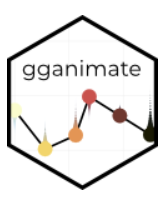

### Instalação e importação dos pacotes

Instlação de pacotes

```{r instalação}
install.packages("tidyr")
install.packages("ggplot2")
install.packages("plotly") # para graficos interativos
install.packages("gganimate")
install.packages("gifski")  # salva animações em gif
install.packages("av")  # salva animações em vídeo
```

Importação de pacotes

```{r importação}
library(dplyr)
library(ggthemes)
library(tidyr)
library(ggplot2)
library(plotly)
library(gganimate)
library(gifski)
library(av)

library(RColorBrewer)
```

### Entendendo os pacotes `gganimate` e `plotly`

#### gganimate

{width="13%"} O pacote `gganimate` extende as funções do `ggplot2` para gráficos animados. A gramática do `gganimate` é totalmente compatível com o `ggplot2` e permite especificar transições e animações de maneira flexível e extensível.

Intro às funções: A documentação da função `animate()` descreve como especificar como a animação é renderizada, enquanto a documentação para as diferentes funções de transição, por exemplo, `transition_states()`, descreve como declarar a animação.

```{r Pacote gganimate}
help("gganimate")
ls("package:gganimate")
```

#### plotly

gjhggh

### Importando e analisando o dataframe CO2 do pacote data()

#### Sobre o data frame CO2:

O dataframe CO2 tem 84 linhas e 5 colunas de dados de um experimento sobre a tolerância ao frio de gramíneas da espécie Echinochloa crus-galli.

```{r pacote de dataframes do R e dataframe CO2}
data() # lista os dataframes do R

help("CO2")
```

#### Colunas:

**Plant** \<- um fator ordenado com níveis Qn1 \< Qn2 \< Qn3 \< ... \< Mc1 dando um identificador único para cada planta

**Type** \<- um fator com níveis *Quebec Mississippi* dando a origem da planta

**Treatment** \<- um fator com níveis `nonchilled` (não refrigerados) e `chilled` (refrigerados)

**conc** \<- um vetor numérico de concentrações ambientais de dióxido de carbono (mL/L).

**uptake** \<- um vetor numérico de taxas de absorção de dióxido de carbono (umol/*m2* sec)

```{r importando e analisando pacote CO2 R}

co2 <- data.frame(CO2) #importa o pacote CO2 e atribui à variável co2

View(co2)
str(co2)
```

### Criando Gráficos

#### Gráfico 1

##### x = conc \| y = uptake \| colour = uptake \| facet_wrap = \~Type

Neste gráfico aplicamos uma **escala contínua** de classificação por cor dos valores, por termos utilizado os dados de `uptake` como referência.

```{r gráfico discreto com ggplot2 do df co2}

gr1 <- ggplot(co2, aes(x=conc, y=uptake, colour = uptake)) + 
  geom_jitter(shape=16, alpha = 0.5, size = 5, show.legend = FALSE) +
  scale_color_continuous_tableau(palette = "Orange") +
  facet_wrap(~Type) 


print(gr1)
ggplotly(gr1, tooltip = c("y","x"))
```

```{r animando o gráfico}
transition_states()
animate()

gr1_2 <- gr1 + transition_states(Type)
gr1_3 <- animate(gr1_2, fps = 60 , renderer = gifski_renderer())

print(gr1_3) # o gganimate() não reconheceu a paleta de cores do ggthemes()
```

#### Gráfico 2

##### x = conc \| y = uptake \| colour = Treatment \| facet_wrap = \~Type

Vamos realizar uma classificação **discreta** dos valores, desta vez a diferença vai ser na classificação de cores, que vai levar em consideração se eles foram refrigerados ou não (coluna `treatment`.

As plantas não refrigeradas estão representadas pelo laranja, e as refrigeradas pelo azul. Dessa forma, uma nova informação relevante torna-se visível para nós.

```{r gráfico contínuo do df co2}

gr2 <- ggplot(co2, aes(x=conc, y=uptake, colour = Treatment)) +
  geom_jitter(shape=16, alpha = 0.5, size = 5, show.legend = FALSE) +
  scale_color_discrete(type = c("#FF661A", "#00AACC"))+
  facet_wrap(~Type)


print(gr2)
ggplotly(gr2, tooltip = c("y","x","colour"))

```

```{r animando o gráfico}

transition_states()
gr2_1 <- gr2 + transition_states(Type)
gr2_3 <- animate(gr2_1, fps = 30 , renderer = gifski_renderer())

gr2_3 %>% save_gif()

print(gr2_3)
```

Obs.: seria legal se tivesse como a gnt ver os dados de `Quebec` e `Mississipi` lado a lado em simultaneo na animação e não intercalado. Uma sugestão é acrescentar uma coluna de contagem, para inserir como coluna de referência em `transition_states()`.

```{r adicionando uma nova coluna ao df co2}

str(co2)

co2["count"] <- seq(1,84)
View(co2)
```

A coluna `count` não deu certo na hora de animar, não sei bem porque.

Testando a animação com a coluna `conc`.

```{r }

gr2_1 <- gr2 + transition_time(conc) +
  labs(subtitle = "concentration: {frame_time}") +
  shadow_wake(wake_length = 0.1)

#código anterior: animate(gr2_1, renderer = gifski_renderer())
animate(gr2_1, height = 500, width = 800, fps = 30, duration = 10, res = 100)
anim_save("conc_graph1.gif")

av::av_encode_video()
```
